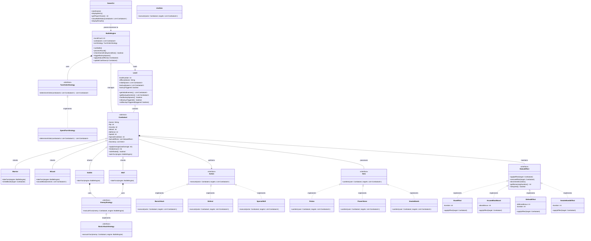

```mermaid
classDiagram
   %% ==========================================
   %% BOUNDARY LAYER (User Interface)
   %% ==========================================
   class GameCLI {
       +startGame()
       +displayMenu()
       +getPlayerChoice() int
       +showBattleStats(combatants: List~Combatant~)
+displayResults()
   }


   %% ==========================================
   %% CONTROL LAYER (Battle Management & Logic)
   %% ==========================================
   class BattleEngine {
       -roundCount: int
       -combatants: List~Combatant~
       -turnStrategy: TurnOrderStrategy
       +runBattle()
       +processRound()
       +checkGameEndingCondition() boolean
       +triggerBackupSpawn()
	+applyStatusEffects(c:Combatant)
	+updateCoolDown(c:Combatant)
   }


   class TurnOrderStrategy {
       <<interface>>
       +determineOrder(combatants: List~Combatant~) List~Combatant~
   }


   class SpeedTurnStrategy {
       +determineOrder(combatants: List~Combatant~) List~Combatant~
   }


  
   %% ==========================================
   %% DOMAIN LAYER (Entities & Abstractions)
   %% ==========================================
   class Combatant {
       <<abstract>>
       #name: String
       #hp: int
       #maxHp: int
       #attack: int
       #defense: int
       #speed: int
       #specialCooldown: int
       #activeEffects: List~StatusEffect~
       #inventory: List~Item~
       +applyDamage(rawDamage: int)
       +heal(amount: int)
       +isDefeated() boolean
       +takeTurn(engine: BattleEngine)*
   }


   class Level{
       -levelNumber: int 
-difficultyName: String 
-initialSpawns: List~Combatant~ 
-backupSpawns: List~Combatant~ 
-backupTriggered: boolean 
+getInitialEnemies() List~Combatant~ 
+getBackupEnemies() List~Combatant~ 
+hasBackupSpawns() boolean 
+isBackupTriggered() boolean 
+setBackupTriggered(triggered: boolean)
   }


   %% Players
   class Warrior {
       +takeTurn(engine: BattleEngine)
       +shieldBash(target: Combatant)
   }


   class Wizard {
       +takeTurn(engine: BattleEngine)
       +arcaneBlast(enemies: List~Combatant~)
   }


   %% Enemies
   class Goblin {
       +takeTurn(engine: BattleEngine)
   }


   class Wolf {
       +takeTurn(engine: BattleEngine)
   }


   class EnemyStrategy {
       <<interface>>
	+executeTurn(enemy: Combatant, engine: BattleEngine)
   }


   class BasicAttackStrategy {
       <<interface>>
       +executeTurn(enemy: Combatant, engine: BattleEngine)
   }


   %% Actions
   class Action {
       <<interface>>
       +execute(actor: Combatant, targets: List~Combatant~)
   }


   class BasicAttack {
       +execute(actor: Combatant, targets: List~Combatant~)
   }


   class Defend {
       +execute(actor: Combatant, targets: List~Combatant~)
   }


   class SpecialSkill {
       +execute(actor: Combatant, targets: List~Combatant~)
   }


   class UseItem {
       +execute(actor: Combatant, targets: List~Combatant~)
   }


   %% Items
   class Item {
       <<interface>>
       +useItem(user: Combatant, targets: List~Combatant~)
   }


   class Potion {
       +useItem(user: Combatant, targets: List~Combatant~)
   }


   class PowerStone {
       +useItem(user: Combatant, targets: List~Combatant~)
   }


   class SmokeBomb {
       +useItem(user: Combatant, targets: List~Combatant~)
   }


   %% Status Effects
   class StatusEffect {
       <<interface>>
       +applyEffect(target: Combatant)
       +removeEffect(target: Combatant)
       +decrementDuration()
       +getRemainingDuration() int
       +isExpired() boolean
   }


   class StunEffect {
       -duration: int
       +applyEffect(target: Combatant)
   }


   class ArcaneBlastBoost {
       -attackBonus: int
       +applyEffect(target: Combatant)
   }


   class DefendEffect {
       -defenseBonus: int 
       -duration: int
       +applyEffect(target: Combatant)
   }


   class SmokeBombEffect {
       -duration: int
       +applyEffect(target: Combatant)
   }


   %% ==========================================
   %% RELATIONSHIPS
   %% ==========================================
  
   %% UI to Engine
   GameCLI --> BattleEngine : passes decisions to
   BattleEngine --> Level : loads


   %% Engine to Core Abstractions
   BattleEngine o-- Combatant : manages
   BattleEngine *-- TurnOrderStrategy : uses
   TurnOrderStrategy <|.. SpeedTurnStrategy : implements


   %% Inheritance (LSP)
   Combatant <|-- Warrior : inherits
   Combatant <|-- Wizard : inherits
   Combatant <|-- Goblin : inherits
   Combatant <|-- Wolf : inherits


   %% Composition / Aggregation
   Combatant *-- StatusEffect : maintains
   Combatant o-- Item : possesses
   Level o-- Combatant : contains 


  
   %% Action Execution (DIP & OCP)
   Combatant --> Action : performs
   Action <|.. BasicAttack : implements
   Action <|.. Defend : implements
   Action <|.. SpecialSkill : implements


   %% Item Implementations
   Item <|.. Potion : implements
   Item <|.. PowerStone : implements
   Item <|.. SmokeBomb : implements


   %% Status Effect Implementations
   StatusEffect <|.. StunEffect : implements
   StatusEffect <|.. ArcaneBlastBoost : implements
   StatusEffect <|.. DefendEffect: implements 
   StatusEffect <|.. SmokeBombEffect: implements


   %% Enemy Strategy (OCP)
   Goblin *-- EnemyStrategy : uses
   Wolf *-- EnemyStrategy : uses
   EnemyStrategy <|.. BasicAttackStrategy : implements
```
