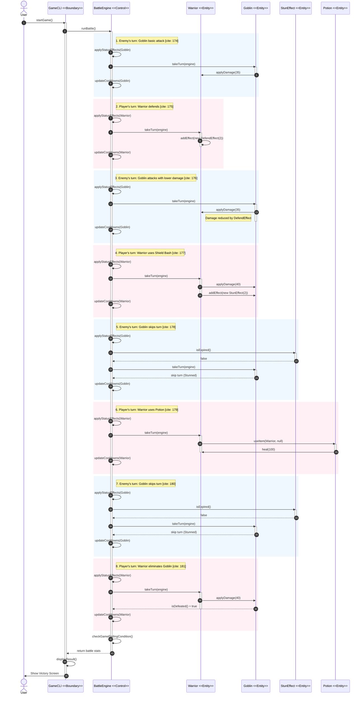

```mermaid
sequenceDiagram
   autonumber
  
   %% Define Participants mapping to BCE (Boundary, Control, Entity)
   actor User
   participant CLI as GameCLI <<Boundary>>
   participant Engine as BattleEngine <<Control>>
   participant W as Warrior <<Entity>>
   participant G as Goblin <<Entity>>
   participant SE as StunEffect <<Entity>>
   participant P as Potion <<Entity>>


   User ->> CLI: startGame()
   activate CLI
   CLI ->> Engine: runBattle()
   activate Engine


   %% Step 1
   rect rgb(240, 248, 255)
       note right of Engine: 1. Enemy's turn: Goblin basic attack [cite: 174]
       Engine ->> Engine: applyStatusEffects(Goblin)
       Engine ->> G: takeTurn(engine)
       activate G
       G ->> W: applyDamage(35)
       deactivate G
       Engine ->> Engine: updateCooldowns(Goblin)
   end


   %% Step 2
   rect rgb(255, 240, 245)
       note right of Engine: 2. Player's turn: Warrior defends [cite: 175]
       Engine ->> Engine: applyStatusEffects(Warrior)
       Engine ->> W: takeTurn(engine)
       activate W
       W ->> W: addEffect(new DefendEffect(2))
       deactivate W
       Engine ->> Engine: updateCooldowns(Warrior)
   end


   %% Step 3
   rect rgb(240, 248, 255)
       note right of Engine: 3. Enemy's turn: Goblin attacks with lower damage [cite: 176]
       Engine ->> Engine: applyStatusEffects(Goblin)
       Engine ->> G: takeTurn(engine)
       activate G
       G ->> W: applyDamage(35)
       note right of W: Damage reduced by DefendEffect
       deactivate G
       Engine ->> Engine: updateCooldowns(Goblin)
   end


   %% Step 4
   rect rgb(255, 240, 245)
       note right of Engine: 4. Player's turn: Warrior uses Shield Bash [cite: 177]
       Engine ->> Engine: applyStatusEffects(Warrior)
       Engine ->> W: takeTurn(engine)
       activate W
       W ->> G: applyDamage(40)
       W ->> G: addEffect(new StunEffect(2))
       deactivate W
       Engine ->> Engine: updateCooldowns(Warrior)
   end


   %% Step 5
   rect rgb(240, 248, 255)
       note right of Engine: 5. Enemy's turn: Goblin skips turn [cite: 178]
       Engine ->> Engine: applyStatusEffects(Goblin)
       Engine ->> SE: isExpired()
       activate SE
       SE -->> Engine: false
       deactivate SE
       Engine ->> G: takeTurn(engine)
       activate G
       G -->> Engine: skip turn (Stunned)
       deactivate G
       Engine ->> Engine: updateCooldowns(Goblin)
   end


   %% Step 6
   rect rgb(255, 240, 245)
       note right of Engine: 6. Player's turn: Warrior uses Potion [cite: 179]
       Engine ->> Engine: applyStatusEffects(Warrior)
       Engine ->> W: takeTurn(engine)
       activate W
       W ->> P: useItem(Warrior, null)
       activate P
       P ->> W: heal(100)
       deactivate P
       deactivate W
       Engine ->> Engine: updateCooldowns(Warrior)
   end


   %% Step 7
   rect rgb(240, 248, 255)
       note right of Engine: 7. Enemy's turn: Goblin skips turn [cite: 180]
       Engine ->> Engine: applyStatusEffects(Goblin)
       Engine ->> SE: isExpired()
       activate SE
       SE -->> Engine: false
       deactivate SE
       Engine ->> G: takeTurn(engine)
       activate G
       G -->> Engine: skip turn (Stunned)
       deactivate G
       Engine ->> Engine: updateCooldowns(Goblin)
   end


   %% Step 8
   rect rgb(255, 240, 245)
       note right of Engine: 8. Player's turn: Warrior eliminates Goblin [cite: 181]
       Engine ->> Engine: applyStatusEffects(Warrior)
       Engine ->> W: takeTurn(engine)
       activate W
       W ->> G: applyDamage(40)
       G -->> Engine: isDefeated() = true
       deactivate W
       Engine ->> Engine: updateCooldowns(Warrior)
   end


   Engine ->> Engine: checkGameEndingCondition()
   Engine -->> CLI: return battle stats
   deactivate Engine
   CLI ->> CLI: displayResult()
   CLI ->> User: Show Victory Screen
   deactivate CLI

```
